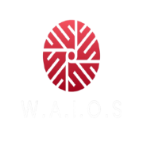

# 🌑 WAI-OS | Who Am I?

  

O **WAI-OS** é uma estação de trabalho adaptativa projetada pela **WAI SOFT**. Este ambiente foi construído sob a filosofia da **Restrição Celestial**, eliminando o supérfluo para entregar performance bruta e soberania digital a @samuelwhite777.

## 🏗️ Status [ALPHA 0.1]
A fundação técnica (Kernel Zen e Particionamento Btrfs) está consolidada.
